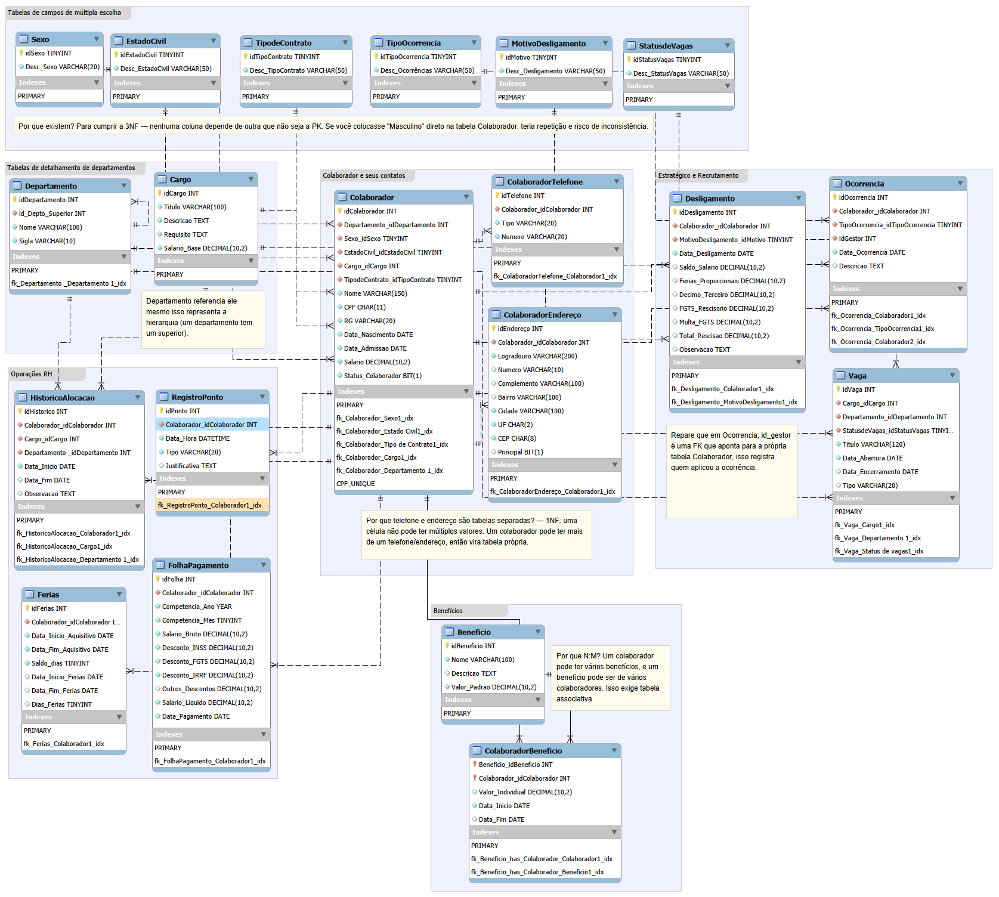

# HumanData RH Solutions

Modelagem de banco de dados relacional para um sistema fictício de gestão de Recursos Humanos, desenvolvido como projeto final da disciplina de Banco de Dados 1 no Centro Universitário de Brasília (CEUB).

O projeto cobre o ciclo completo de modelagem de dados: levantamento de requisitos, modelo lógico, normalização (1NF–3NF), modelo físico em MySQL e scripts de carga e consulta.

## Sobre o projeto

A HumanData RH Solutions é uma empresa fictícia criada para resolver um problema comum em setores de RH: descentralização de informações, excesso de planilhas isoladas e dificuldade no gerenciamento de colaboradores, vagas, ocorrências e desligamentos.

A proposta foi centralizar todos os processos de RH — do cadastro ao desligamento — em um único banco de dados:

- **Normalizado** (1NF–3NF), sem redundâncias e com tabelas de domínio para campos de múltipla escolha
- **Íntegro**, com chaves estrangeiras (`ON DELETE RESTRICT`) impedindo exclusões inconsistentes
- **Transacional**, usando o engine InnoDB (ACID) para garantir que operações como fechamento de folha nunca gravem dados parciais
- **Orientado à LGPD**, com previsão de controle de acesso a campos sensíveis (CPF, RG, salário)

## Funcionalidades modeladas

O sistema cobre dois grandes grupos de requisitos funcionais:

**Gestão de Pessoas e Estrutura**
- Cadastro completo de colaboradores (CRUD)
- Gestão de cargos e organograma (departamentos com hierarquia recursiva)
- Histórico de alocação (movimentações internas)
- Controle de frequência (ponto)
- Folha de pagamento (INSS, FGTS, IRRF)
- Controle de férias
- Gestão de benefícios (relacionamento N:M)
- Registro de ocorrências (advertências, suspensões, elogios)
- Desligamento e rescisão

**Desenvolvimento e Relatórios**
- Gestão de treinamentos
- Avaliação de desempenho
- Recrutamento e abertura de vagas
- Relatório de folha mensal
- Consulta de aniversariantes e tempo de casa (usando `MONTH()` e `TIMESTAMPDIFF()`)

A lista completa dos 15 requisitos funcionais (RF01–RF15) e 5 requisitos não funcionais (RNF01–RNF05) está detalhada no [relatório técnico](./docs/RelatorioDB_RH.pdf).

## Modelo de dados

O banco foi projetado no MySQL Workbench e implementado com 20 tabelas, organizadas em seis grupos lógicos:

| Grupo | Tabelas |
|---|---|
| Domínio (lookup) | `Sexo`, `EstadoCivil`, `TipodeContrato`, `TipoOcorrencia`, `MotivoDesligamento`, `StatusdeVagas` |
| Estrutura organizacional | `Departamento` (hierarquia recursiva), `Cargo` |
| Colaborador e contatos | `Colaborador`, `ColaboradorTelefone`, `ColaboradorEndereço` |
| Operações de RH | `HistoricoAlocacao`, `RegistroPonto`, `FolhaPagamento`, `Ferias` |
| Benefícios | `Beneficio`, `ColaboradorBeneficio` (N:M) |
| Recrutamento e desligamento | `Vaga`, `Ocorrencia`, `Desligamento` |

### Diagrama ER



### Principais decisões de modelagem

- **Tabelas de domínio** em vez de `ENUM`: campos como sexo, estado civil e tipo de contrato vivem em tabelas próprias referenciadas por FK, evitando a necessidade de `ALTER TABLE` na entidade principal quando uma opção muda.
- **Separação de telefone e endereço** do colaborador: atende à 1NF, evitando múltiplos valores em uma mesma célula — um colaborador pode ter mais de um telefone ou endereço.
- **Departamento com relacionamento recursivo** (`id_Depto_Superior`): permite representar a hierarquia organizacional (departamento que tem um departamento superior) sem precisar de uma tabela extra.
- **`ColaboradorBeneficio`** como tabela associativa: resolve o relacionamento N:M entre colaboradores e benefícios, armazenando também valor individual e vigência.
- **FK de gestor em `Ocorrencia`**: a coluna `idGestor` aponta para a própria tabela `Colaborador`, registrando quem aplicou cada ocorrência.

### Normalização

| Forma Normal | Aplicação |
|---|---|
| 1FN | Atributos atômicos; sem repetição de grupos de dados (telefone e endereço separados do colaborador) |
| 2FN | Nenhum atributo depende apenas de parte de uma chave primária composta |
| 3FN | Eliminação de dependências transitivas via tabelas de domínio (Sexo, Estado Civil, Tipo de Contrato, Motivo de Desligamento) |

## Estrutura do repositório

```
HumanData-RH-Solutions/
├── README.md
├── LICENSE
├── sql/
│   └── HumanData_RH_Solutions.sql      # Script DDL + DML completo (criação + carga + consultas)
├── workbench/
│   └── HumanData_RH_Solutions.mwb      # Modelo no MySQL Workbench
└── docs/
    ├── RelatorioDB_RH.pdf              # Relatório técnico completo
    ├── HumanData_RH_Apresentacao.pdf   # Slides de apresentação do projeto
    └── diagrama-er.png                 # Export do diagrama ER
```

## Tecnologias

- **MySQL 8** — SGBD relacional
- **MySQL Workbench** — modelagem visual (ER) e forward engineering do schema
- **InnoDB** — engine transacional (ACID)

## Como executar

1. Clone o repositório:
   ```bash
   git clone https://github.com/Davi-Felinto/HumanData-RH-Solutions.git
   ```
2. Abra o MySQL Workbench (ou outro cliente MySQL) e conecte a uma instância local.
3. Execute o script `sql/HumanData_RH_Solutions.sql`. Ele cria o schema `HumanData_RH_Solutions`, todas as 20 tabelas com chaves primárias/estrangeiras, popula as tabelas de domínio e os dados de exemplo, e roda um conjunto de consultas de teste (`SELECT`).
4. Para visualizar ou editar o modelo graficamente, abra `workbench/HumanData_RH_Solutions.mwb` no MySQL Workbench.

## Requisitos não funcionais

| Código | Descrição |
|---|---|
| RNF01 | Integridade referencial via `FOREIGN KEY ... ON DELETE RESTRICT` |
| RNF02 | Segurança e privacidade (LGPD) — acesso restrito a campos sensíveis |
| RNF03 | Desempenho de busca — índices (`INDEX`) em CPF e Nome |
| RNF04 | Padronização de dados (3NF) via tabelas de domínio |
| RNF05 | Confiabilidade transacional — engine InnoDB (ACID) |

## Autores

Projeto desenvolvido em grupo para a disciplina de Banco de Dados 1 (Prof. Guilherme Mendonça), CEUB — 1º semestre de 2026.

- Amanda de Oliveira Weiler
- **Davi Felinto de Moraes**
- Miguel Mendonça Dias

## Licença

Este projeto está sob a licença MIT — veja o arquivo [LICENSE](./LICENSE) para mais detalhes.
